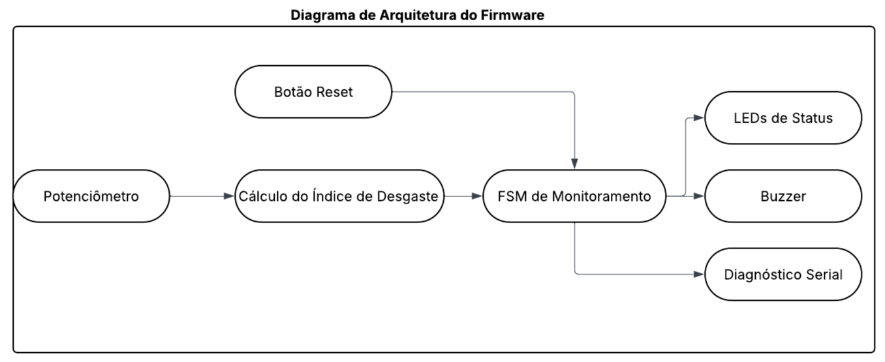
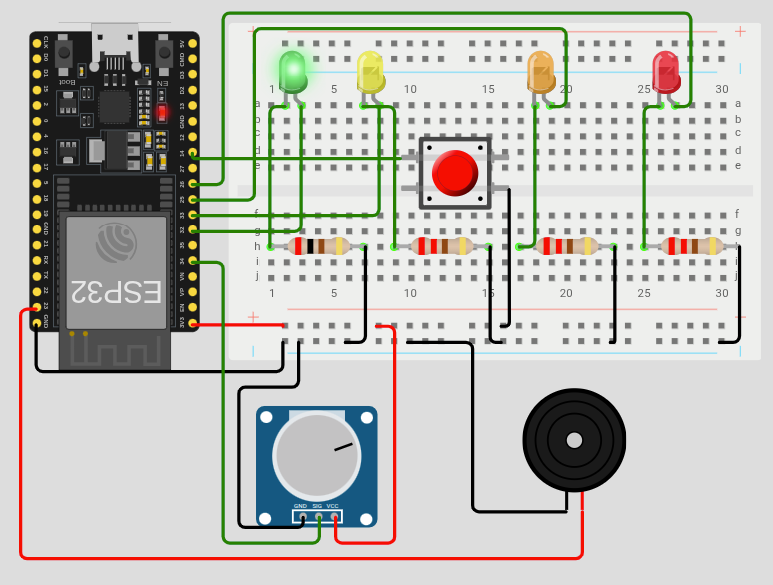
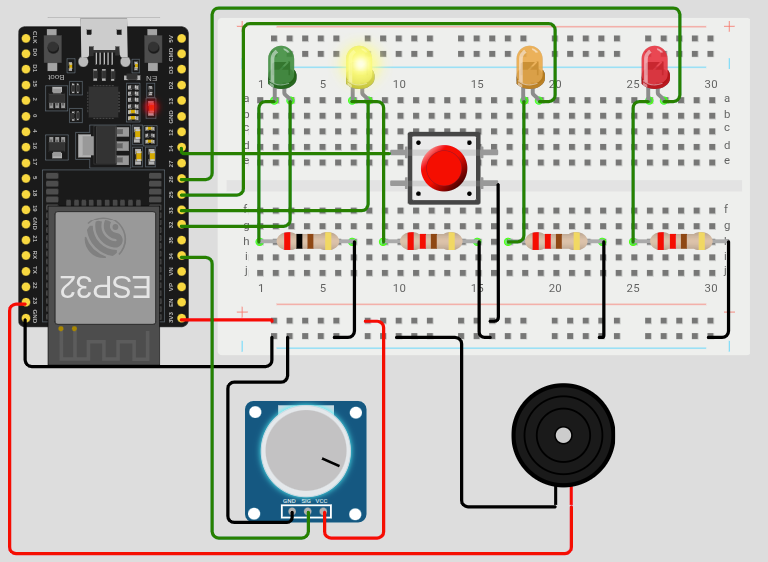
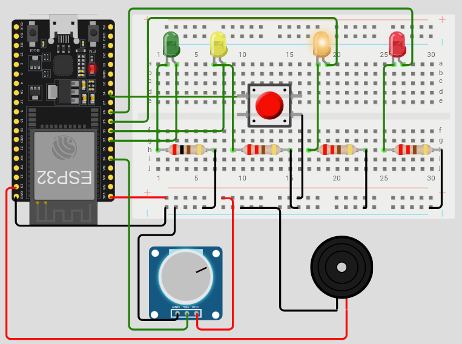
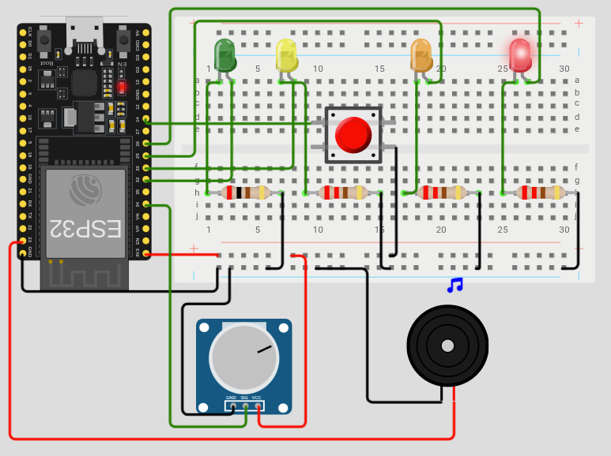

# Sistema Embarcado para Monitoramento de Desgaste com ESP32 e Wokwi


## Relatório do Candidato

Identificação:

| Nome                         | GitHub                                                 |
| ---------------------------- | ------------------------------------------------------ |
| Leôncio Ferreira Flores Neto | [@LeoncioFerreira](https://github.com/LeoncioFerreira) |

## Navegação Rápida

- [Como Usar a Simulação](#como-usar-a-simulação)
- [1. Visão Geral da Solução](#1-visão-geral-da-solução)
- [2. Arquitetura do Sistema Embarcado](#2-arquitetura-do-sistema-embarcado)
- [3. Componentes Utilizados na Simulação](#3-componentes-utilizados-na-simulação)
- [4. Decisões Técnicas Relevantes](#4-decisões-técnicas-relevantes)
- [5. Resultados Obtidos](#5-resultados-obtidos)
- [6. Comentários Adicionais](#6-comentários-adicionais)

## Estrutura do Projeto

```text
.
├── src/
│   ├── main.py              # Loop principal não bloqueante
│   ├── config.py            # Pinos, thresholds e parâmetros globais
│   ├── health.py            # Cálculo do índice de desgaste
│   ├── fsm.py               # Máquina de estados do sistema
│   ├── states.py            # Estados possíveis da FSM
│   ├── potentiometer.py     # Leitura analógica e suavização do potenciômetro
│   ├── button.py            # Leitura do botão com debounce
│   ├── output.py            # Controle de LEDs e buzzer
│   └── time_utils.py        # Utilitários de temporização por ticks
├── diagram.json             # Circuito da simulação no Wokwi
├── wokwi.toml               # Configuração da simulação
├── criterios.md             # Critérios de avaliação do desafio
├── docs/
│   ├── Diagrama-de-Arquitetura-do-Firmware.png
│   ├── Estado-normal.png
│   ├── Estado-atenção.png
│   ├── Estado-alerta.png
│   └── Estado-critico.png
└── README.md                # Relatório técnico do projeto
```

Essa organização foi escolhida para separar responsabilidades do firmware e deixar explícita a arquitetura do sistema: leitura de entradas, processamento do desgaste, transições de estado e acionamento dos atuadores.

Do ponto de vista físico da simulação, a montagem também foi pensada para ser compacta e racional. O circuito foi concentrado em uma protoboard half-size, a menor necessária para acomodar os componentes com clareza, reduzindo dispersão visual e reforçando o uso otimizado dos recursos do Wokwi.

## Sistema de arquivos (`fs.bin`)

O arquivo `fs.bin` contém o filesystem usado na simulação Wokwi, foi versionado para garantir reprodutibilidade do projeto e é obrigatório para executar o Wokwi local com a configuração atual, já que o carregamento do filesystem depende desse artefato pronto.

## Como Usar a Simulação

Para interagir com o sistema no Wokwi:

1. gire o potenciômetro para aumentar ou reduzir o nível de estresse da máquina;
2. observe a progressão dos estados `NORMAL -> ATTENTION -> ALERT -> CRITICAL` conforme o desgaste acumulado cresce;
3. acompanhe a sinalização visual pelos LEDs e a telemetria exibida no monitor serial;
4. ao atingir `CRITICAL`, observe o LED vermelho e o buzzer, indicando severidade máxima e necessidade urgente de manutenção;
5. após a manutenção, pressione o botão para resetar o sistema e retornar à operação normal.

## 1. Visão Geral da Solução

Este projeto implementa um sistema embarcado simulado no Wokwi com ESP32 para monitoramento progressivo de desgaste de uma máquina. O valor de entrada é fornecido por um potenciômetro, interpretado como nível de estresse operacional, e o sistema reage por meio de LEDs, buzzer e saída serial.

O problema proposto vai além de simplesmente ler um valor analógico e acender saídas. A necessidade real é representar, de forma organizada e confiável, um cenário em que o esforço aplicado a uma máquina gera desgaste progressivo, mudança de severidade operacional e necessidade de intervenção humana em condições críticas.

Dentro desse contexto, a solução precisava atender simultaneamente a cinco pontos: leitura de sensor, processamento lógico, sinalização por atuadores, organização de firmware e coerência entre código e hardware simulado. A arquitetura escolhida foi guiada por esse problema e não apenas por conveniência de implementação.

O comportamento foi modelado para representar uma evolução gradual de severidade. Em vez de responder apenas ao valor instantâneo do sensor, o firmware calcula um índice acumulado de desgaste, permitindo diferenciar situações transitórias de condições críticas persistentes.

Interação do usuário:

- o potenciômetro controla o nível de estresse aplicado ao sistema;
- o botão é utilizado para resetar a condição crítica após intervenção;
- os LEDs indicam visualmente o estado atual;
- o buzzer atua como alarme sonoro em condição crítica;
- o monitor serial apresenta estado, desgaste e tendência a cada ciclo.

## 2. Arquitetura do Sistema Embarcado

O firmware foi estruturado de forma modular e orientada a responsabilidades. O arquivo `main.py` coordena o loop principal, enquanto os demais módulos encapsulam hardware, regras de negócio e lógica de transição de estados. Essa separação melhora legibilidade, manutenção e consistência com boas práticas de engenharia embarcada.

### Fluxo principal do firmware

O ciclo de execução segue a lógica:

`leitura do botão -> controle de intervalo -> leitura do potenciômetro -> atualização do desgaste -> atualização da FSM -> acionamento dos atuadores -> telemetria serial`

Esse fluxo é executado de maneira não bloqueante com base em `ticks_ms()`, evitando uso de `sleep()` no loop principal. Essa decisão foi importante para manter o sistema responsivo à leitura do botão e à atualização periódica dos atuadores.

### Arquitetura lógica

- `potentiometer.py` lê o ADC do potenciômetro e aplica média móvel simples para suavização do sinal.
- `health.py` converte o nível de estresse em índice de desgaste acumulado e tendência.
- `fsm.py` define as transições entre `NORMAL`, `ATTENTION`, `ALERT` e `CRITICAL`.
- `button.py` trata o botão com debounce por tempo.
- `output.py` atualiza LEDs e buzzer conforme o estado atual.
- `config.py` centraliza pinos, thresholds e parâmetros temporais.

### Diagrama da arquitetura do firmware

<p align="center">
  
</p>

O diagrama evidencia que a solução foi estruturada em camadas com responsabilidades bem definidas, separando entradas, processamento, lógica de estados e acionamento dos atuadores.
- leitura das entradas físicas;
- processamento do desgaste;
- transição de estados;
- acionamento dos atuadores;
- telemetria serial.

Em termos de documentação técnica, esse diagrama é importante porque torna visível o fluxo de dados do sistema. Ele mostra que o potenciômetro e o botão não atuam diretamente sobre LEDs e buzzer; antes disso, os sinais passam pela lógica de cálculo do desgaste e pela FSM. Isso reforça a robustez da solução, pois a saída final depende de regras explícitas de processamento e não apenas de acionamentos diretos.

### Máquina de estados

O sistema utiliza uma FSM para explicitar o comportamento por severidade:

- `NORMAL`: operação segura, LED verde ligado; significado operacional: máquina em funcionamento estável.
- `ATTENTION`: desgaste inicial, LED amarelo ligado; significado operacional: primeiros sinais de degradação, exigindo observação.
- `ALERT`: condição de alerta, LED laranja ligado; significado operacional: desgaste elevado, com aproximação de condição crítica.
- `CRITICAL`: condição crítica, LED vermelho e buzzer ativos até ação do operador; significado operacional: severidade máxima e necessidade urgente de manutenção.

Após entrar em `CRITICAL`, o sistema mantém esse estado até que o botão seja pressionado. Essa decisão reforça a prioridade de segurança: uma condição crítica não deve ser descartada automaticamente apenas porque o potenciômetro foi reduzido logo em seguida.

As ativações dos estados acontecem a partir do índice de desgaste calculado em `health.py` e avaliado em `fsm.py`. Na prática, os estados são ativados nas seguintes condições:

- `NORMAL`: quando o desgaste fica abaixo de `THRESHOLD_ATTENTION - HYSTERESIS`, isto é, abaixo de `25`;
- `ATTENTION`: quando o desgaste atinge pelo menos `30`;
- `ALERT`: quando o desgaste atinge pelo menos `55`;
- `CRITICAL`: quando o desgaste atinge pelo menos `75`.

Esses limiares foram definidos em `config.py` e foram usados para separar claramente cada faixa de severidade operacional. A histerese de `5` pontos foi aplicada para evitar alternância excessiva entre `NORMAL` e `ATTENTION` em situações limítrofes.

### Evidência visual dos estados

Estado `NORMAL`:

<p align="center">
  
</p>

- ativação: desgaste abaixo de `25`;
- sinalização: LED verde;
- significado operacional: funcionamento estável, sem necessidade de alerta.

Estado `ATTENTION`:

<p align="center">
  
</p>

- ativação: desgaste maior ou igual a `30`;
- sinalização: LED amarelo;
- significado operacional: início de degradação, exigindo observação.

Estado `ALERT`:

<p align="center">
  
</p>

- ativação: desgaste maior ou igual a `55`;
- sinalização: LED laranja;
- significado operacional: desgaste elevado, com aproximação de condição crítica.

Estado `CRITICAL`:

<p align="center">
  
</p>

- ativação: desgaste maior ou igual a `75`;
- sinalização: LED vermelho e buzzer;
- significado operacional: severidade máxima, com necessidade urgente de manutenção e retenção até reset manual.

## 3. Componentes Utilizados na Simulação

Os principais componentes definidos no `diagram.json` foram:

| Componente | Pino / Interface | Função no sistema |
| ---------- | ---------------- | ----------------- |
| ESP32 DevKit C V4 | Placa principal | Executa o firmware em MicroPython |
| Potenciômetro | `GPIO 34` | Simula o nível de estresse da máquina |
| Botão | `GPIO 14` | Realiza reset manual após estado crítico |
| Buzzer | `GPIO 23` | Emite alarme sonoro em `CRITICAL` |
| LED verde | `GPIO 32` | Indica estado `NORMAL` |
| LED amarelo | `GPIO 33` | Indica estado `ATTENTION` |
| LED laranja | `GPIO 25` | Indica estado `ALERT` |
| LED vermelho | `GPIO 26` | Indica estado `CRITICAL` |

Além dos componentes principais, o circuito utiliza resistores para limitar corrente nos LEDs e alimentação organizada via trilhas da protoboard. O diagrama foi mantido coerente com os pinos declarados em `config.py`, reduzindo risco de divergência entre hardware virtual e firmware.

## 4. Decisões Técnicas Relevantes

As decisões técnicas mais importantes do projeto foram as seguintes:

### 4.1 Modularização do firmware

Em vez de concentrar toda a lógica em `main.py`, o projeto foi dividido em módulos com funções específicas. Essa escolha favorece manutenção, testes manuais por inspeção, legibilidade e clareza arquitetural, que são pontos valorizados nos critérios do desafio.

### 4.2 Temporização não bloqueante

O loop principal usa `ticks_ms()` e comparação de intervalos para executar atualizações periódicas sem bloquear a CPU. Isso evita o uso de `sleep()` como mecanismo central de controle e torna o sistema mais estável para leitura contínua de entradas e atualização de saídas.

### 4.3 Uso de máquina de estados finitos

A FSM organiza explicitamente os estados `NORMAL`, `ATTENTION`, `ALERT` e `CRITICAL`, tornando o comportamento previsível e fácil de explicar. Essa abordagem também reduz a chance de lógica espalhada e ambígua no código.

### 4.4 Índice de desgaste acumulado

O sistema não muda de estado apenas pelo valor instantâneo do potenciômetro. O módulo `health.py` acumula desgaste quando o estresse permanece alto e reduz desgaste quando o estresse cai para uma faixa baixa. Isso cria uma dinâmica mais realista de degradação operacional.

Parâmetros principais utilizados:

- `THRESHOLD_ATTENTION = 30`
- `THRESHOLD_ALERT = 55`
- `THRESHOLD_CRITICAL = 75`
- `STRESS_HIGH_THRESHOLD = 65`
- `STRESS_LOW_THRESHOLD = 30`
- `LOOP_INTERVAL_MS = 300`
- `DEBOUNCE_MS = 200`
- `HYSTERESIS = 5`

### 4.5 Histerese e debounce

Foram aplicadas duas estratégias para robustez:

- histerese entre thresholds para reduzir alternância excessiva entre estados próximos;
- debounce por software no botão para evitar falsos eventos de pressionamento.

Essas duas decisões melhoram a estabilidade do sistema tanto na camada lógica quanto na camada de interação com hardware.

### 4.6 Política de segurança no estado crítico

Quando o sistema entra em `CRITICAL`, ele permanece nessa condição até receber confirmação manual via botão. O buzzer é ativado apenas nesse estado, reforçando a ideia de alarme prioritário e evitando sinalização sonora desnecessária em estados intermediários.

### 4.7 Robustez da solução

A robustez do sistema resulta da combinação de:

- arquitetura modular, evitando acoplamento excessivo entre entrada, lógica e saída;
- temporização não bloqueante, mantendo o sistema responsivo;
- média móvel na leitura analógica, reduzindo ruído do potenciômetro;
- histerese na FSM, evitando oscilação excessiva entre estados próximos;
- debounce no botão, prevenindo acionamentos falsos;
- retenção do estado crítico até confirmação manual, priorizando segurança;

Essas decisões tornam o comportamento previsível e estável dentro do escopo do desafio.

### 4.8 Otimização do diagrama e uso de espaço

Além da robustez lógica, houve cuidado com a organização física do circuito no Wokwi. A montagem foi compactada para ocupar apenas os elementos necessários na menor protoboard viável para a solução, mantendo legibilidade das conexões e clareza visual.

As principais escolhas foram:

- uso de protoboard half-size;
- distribuição enxuta dos componentes;
- fios com cores coerentes para alimentação, terra e sinal;
- roteamento simples para facilitar inspeção e manutenção visual.

Essa compactação melhora a qualidade do `diagram.json`, ajuda a demonstrar domínio sobre a montagem simulada e reforça o critério de uso otimizado dos recursos do Wokwi.

## 5. Resultados Obtidos

O comportamento final do sistema atendeu ao objetivo funcional do desafio, combinando leitura de sensor, processamento lógico, sinalização visual, alarme sonoro e interação por botão.

Resultados observados na simulação:

- o potenciômetro altera o nível de estresse de forma contínua;
- o índice de desgaste evolui ao longo do tempo, em vez de responder apenas instantaneamente;
- os LEDs representam corretamente a severidade do estado atual;
- o buzzer é acionado em condição crítica;
- o botão permite resetar o sistema após estado crítico;
- a saída serial informa estado, índice de desgaste e tendência do sistema.

Comportamento por estado:

| Estado | Condição observada | Sinalização |
| ------ | ------------------ | ----------- |
| `NORMAL` | desgaste baixo | LED verde |
| `ATTENTION` | desgaste moderado inicial | LED amarelo |
| `ALERT` | desgaste elevado | LED laranja |
| `CRITICAL` | desgaste crítico acumulado | LED vermelho + buzzer |

Do ponto de vista de evidência técnica, a solução apresenta consistência entre:

- lógica do firmware em `src/`;
- mapeamento de pinos em `config.py`;
- componentes e conexões definidos em `diagram.json`;
- comportamento visual registrado nas imagens em `docs/`.

Em termos de tamanho e otimização física da montagem, o circuito foi propositalmente compactado para ocupar somente o espaço necessário em uma protoboard half-size. Isso resultou em uma simulação mais limpa, funcional e alinhada à ideia de projeto enxuto.

Quanto à automação, o projeto está estruturado para execução no Wokwi com `wokwi.toml` e os artefatos esperados do desafio. A validação final em GitHub Actions depende da configuração correta da secret `WOKWI_API_KEY` no repositório do fork.

## 6. Comentários Adicionais

### Dificuldades encontradas

- coerência entre firmware e diagrama do Wokwi;
- ajuste da lógica de entrada no loop principal;
- compactação do circuito sem perder clareza visual;
- organização modular do código.

### Limitações da solução

- o desgaste é uma abstração simplificada para fins de simulação;
- o foco em manter o circuito no menor tamanho possível limita a adição de novos periféricos sem expandir a montagem;
- o buzzer utiliza uma política binária, ativando apenas no estado crítico;

### Melhorias futuras

- adicionar telemetria mais detalhada com métricas históricas;
- adicionar uma tela OLED para exibir estado, desgaste e alertas localmente;
- registrar eventos críticos em armazenamento local;

### Principais aprendizados

O projeto consolidou práticas importantes de sistemas embarcados:

- modularização do firmware;
- uso de temporização não bloqueante;
- organização de comportamento com máquina de estados;
- integração coerente entre software e hardware simulado.

No contexto do desafio, a solução buscou equilíbrio entre clareza arquitetural, funcionamento correto da simulação e documentação técnica objetiva, mantendo o foco nos critérios de avaliação propostos.
